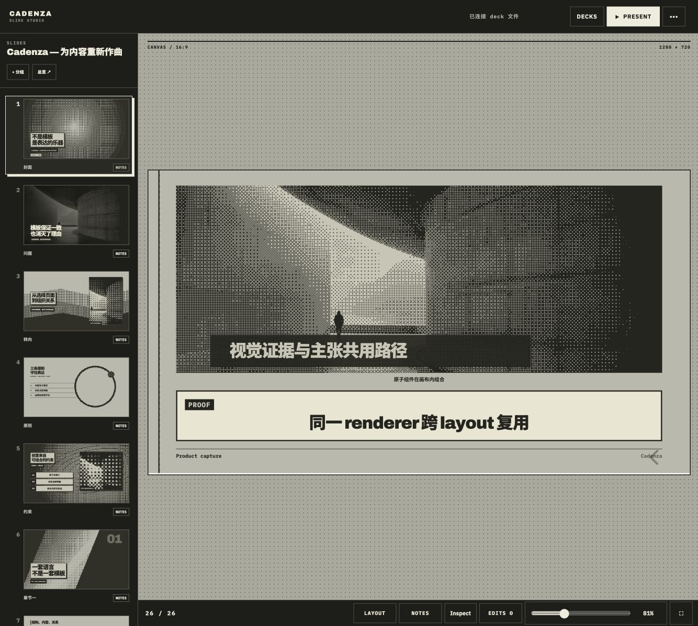
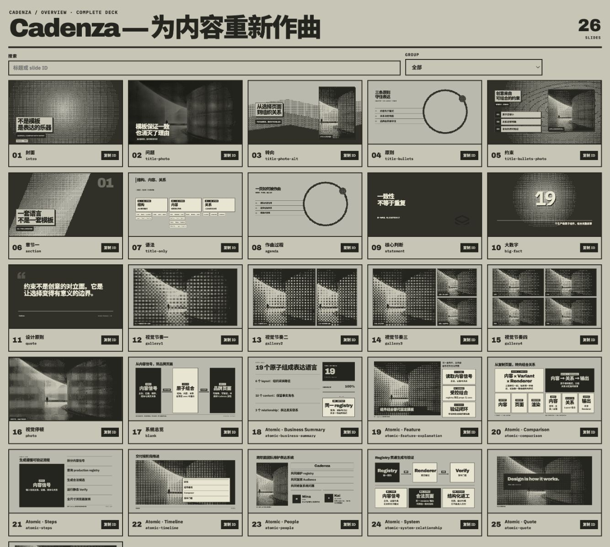

# Tapir Skills

[](https://skills.sh/SuperTapir/tapir-skills)

[English](./README.md) | [中文](./README.zh-CN.md)

一组带有明确取舍和个人偏好的 Agent Skills，覆盖工程判断、应用图标设计、
演示设计与制作、视频逐帧检查、中文写作和 CadenzaOS Launcher Cover 生成。
它们沉淀了我与 AI Agent 协作时采用的方法：先确认根因，明确方案取舍，建立一个
有力的视觉关系，并通过真实流程验证最终结果。

## 安装

安装全部 Skills：

```bash
npx skills@latest add SuperTapir/tapir-skills
```

安装单个 Skill：

```bash
npx skills@latest add SuperTapir/tapir-skills --skill tapir-craft
npx skills@latest add SuperTapir/tapir-skills --skill tapir-icon-craft
npx skills@latest add SuperTapir/tapir-skills --skill tapir-presentation-craft
npx skills@latest add SuperTapir/tapir-skills --skill cadenza-presentations
npx skills@latest add SuperTapir/tapir-skills --skill inspect-video-frames
npx skills@latest add SuperTapir/tapir-skills --skill tapir-writing-voice
npx skills@latest add SuperTapir/tapir-skills --skill generate-launcher-cover-art
```

`cadenza-presentations` 提供 Agent 工作流，不包含 CadenzaSlide runtime。使用前需按
[CadenzaSlide 源码安装说明](https://github.com/SuperTapir/CadenzaSlide#install-from-source)
单独安装 runtime，并确认 `cadenza --help` 可以运行。

## Skills

- **[tapir-craft](./skills/tapir-craft/SKILL.md)** — 以最小正确实现、根因优先、
  明确 trade-off 和自主验证为核心的工程方法。最小方案阶梯改编自
  [Ponytail](https://github.com/DietrichGebert/ponytail)。
- **[tapir-icon-craft](./skills/tapir-icon-craft/SKILL.md)** — 以故事、层级和小尺寸
  识别度为核心的应用图标与 Logo 设计指导。
- **[tapir-presentation-craft](./skills/tapir-presentation-craft/SKILL.md)** — 制作简洁、
  有力、可演讲的视觉叙事，并强调明确动效与可复用的 source-first 系统。
- **[cadenza-presentations](./skills/cadenza-presentations/SKILL.md)** — 通过
  CadenzaSlide runtime 和可迁移 workspace 格式创建、修改、验证、预览与播放演示；
  需要单独安装 `cadenza` CLI。
- **[inspect-video-frames](./skills/inspect-video-frames/SKILL.md)** — 分阶段执行 FFmpeg
  视频检查，包括元数据探测、带时间戳的总览图、局部高帧率提取和逐帧导出。
- **[tapir-writing-voice](./skills/tapir-writing-voice/SKILL.md)** — 按 Tapir 已形成的
  中文写作声音起草、改写和审阅文章，保留真实经历、实践证据、工程判断和克制口语。
- **[generate-launcher-cover-art](./skills/generate-launcher-cover-art/SKILL.md)** —
  通过分阶段门禁生成具有插画感、可读性且经过验证的 1-bit CadenzaOS Launcher
  Cover。

每个 Skill 都是一个可移植目录，根目录包含 `SKILL.md`。部分 Skills 还会包含
references、scripts、examples 和 Agent 专用元数据。除 `tapir-craft` 外，其他 Skills
默认需要使用各自的 `$skill-name` 显式调用。

## CadenzaSlide 实际使用

`cadenza-presentations` 直接操作真实的 Cadenza workspace：在 Studio 中创作，
通过 Overview 扫描完整叙事，最后在 Audience 中验收真实放映结果。

| Studio 创作 | Overview 总览 |
| --- | --- |
|  |  |


## 许可证

MIT。仓库内附带的 Lucide runtime 保留其自身的许可证声明。
